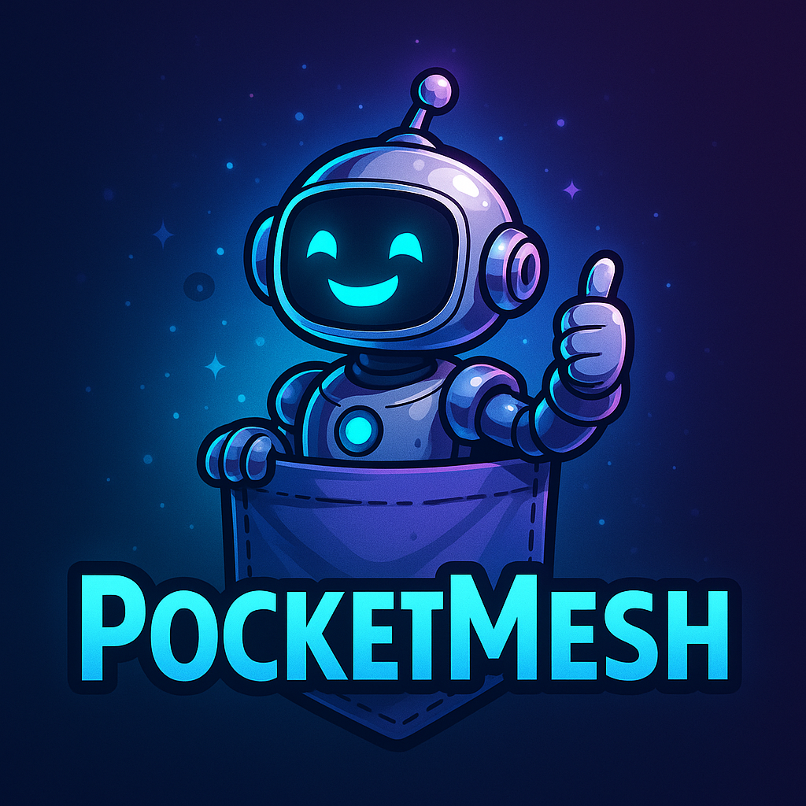

# PocketMesh

[](LICENSE)

---

**Build powerful, type-safe, async-native agentic workflows in TypeScript—**
**with first-class [A2A protocol](https://google.github.io/A2A/) support for open, interoperable agent APIs.**

> **PocketMesh 0.3.0 highlights**
> - Migrated to the official [`@a2a-js/sdk`](https://www.npmjs.com/package/@a2a-js/sdk) for servers, clients, and streaming—no internal fork required.
> - New `createPocketMeshA2AServer` helper and SQLite-backed `PocketMeshTaskStore` integrate PocketMesh flows with the SDK's `DefaultRequestHandler`.
> - Async `createA2AClient` wrapper returns the SDK client (`sendMessage`, `sendMessageStream`, `cancelTask`, …).
> - Expanded Jest coverage (including failure branches and persistence) and refreshed documentation.
> - Extensive developer documentation added, see [`docs/developer/index.md`](./docs/developer/index.md)
>
> See [`docs/MIGRATION_TO_0.3.md`](./docs/MIGRATION_TO_0.3.md) for upgrade guidance from v0.2.x.

---

> **Inspired by [PocketFlow](https://github.com/The-Pocket/PocketFlow):**
> PocketMesh brings the minimalist, expressive, and agentic coding philosophy of PocketFlow (Python) to the TypeScript ecosystem—now with native A2A protocol support and advanced type safety.

---

## Why PocketMesh?

PocketMesh is a modern framework for orchestrating multi-step, multi-agent, and LLM-powered workflows—**with zero boilerplate and full protocol interoperability**.
It lets you compose, persist, and expose agentic flows as open APIs, ready for integration with Google, OpenAI, CrewAI, LangGraph, and more.

---

## What Can I Build?

- **Multi-agent LLM orchestration:** Compose flows that call out to multiple LLMs, tools, or remote agents.
- **Open agent APIs:** Expose your agent’s skills as discoverable, interoperable APIs (A2A protocol).
- **Automated pipelines:** Build robust, retryable, and resumable data or automation pipelines.
- **Composable agentic systems:** Chain, branch, and batch any logic—locally or across the mesh.

---

## 🧠 Agentic Coding: Let Agents Build Flows!

PocketMesh is designed for **AI-driven development** as well as human developers.
Check out [`docs/agent-prompt.md`](./docs/agent-prompt.md) for a **gold-standard prompt** that enables LLMs and agentic coders to generate robust, production-ready PocketMesh flows and nodes—**with best practices, patterns, and protocol compliance built in**.

> **Tip:** Use this prompt to bootstrap new skills, automate flow design, or empower your own agents to code!

---

## Hello, World! (Minimal Example)

```ts
import { Flow, BaseNode } from "pocketmesh";

class HelloNode extends BaseNode {
  async prepare(_shared, params) { return params.name ?? "World"; }
  async execute(name, _shared, _params, _attempt) { return `Hello, ${name}!`; }
  async finalize(shared, _prep, execResult) {
    shared.greeting = execResult;
    return "default";
  }
}

const flow = new Flow(new HelloNode());
const shared = {};
await flow.runLifecycle(shared, { name: "Mesh" });
console.log(shared.greeting); // "Hello, Mesh!"
```

---

## Quickstart: Advanced Agentic Flows

PocketMesh lets you compose **advanced, type-safe agentic workflows**—including branching, multi-node, and batch flows—using a simple, declarative API.

```ts
import { Flow, BaseNode, ActionKey, SharedState } from "pocketmesh";

// Node 1: Greet the user
class GreetNode extends BaseNode {
  async prepare(_shared, params) { return params.name ?? "World"; }
  async execute(name, _shared, _params, _attempt) { return `Hello, ${name}!`; }
  async finalize(shared, _prep, execResult) {
    shared.greeting = execResult;
    return "default";
  }
}

// Node 2: Branch based on a flag
class BranchNode extends BaseNode {
  async prepare(shared) { return shared.greeting; }
  async execute(greeting, _shared, params, _attempt) {
    return params.shout ? "shout" : "echo";
  }
  async finalize(_shared, _prep, action) { return action; }
}

// Node 3a: Echo the greeting
class EchoNode extends BaseNode {
  async prepare(shared) { return shared.greeting; }
  async execute(greeting, _shared, _params, _attempt) { return greeting; }
  async finalize(shared, _prep, execResult) {
    shared.result = execResult;
    return ActionKey.Default;
  }
}

// Node 3b: Shout the greeting (batch node)
class ShoutBatchNode extends BaseNode {
  async prepare(shared) { return [shared.greeting, shared.greeting]; }
  async execute() { throw new Error("Not used in batch node"); }
  async executeItem(item, _shared, _params, _attempt) { return item.toUpperCase(); }
  async finalize(shared, _prep, execResults) {
    shared.result = execResults.join(" ");
    return ActionKey.Default;
  }
}

// Compose the flow
const greet = new GreetNode();
const branch = new BranchNode();
const echo = new EchoNode();
const shout = new ShoutBatchNode();

greet.connectTo(branch);
branch.connectAction("echo", echo);
branch.connectAction("shout", shout);

const flow = new Flow(greet);

// Run the flow
const shared: SharedState = {};
await flow.runLifecycle(shared, { name: "Alice", shout: true });
console.log(shared.result); // "HELLO, ALICE! HELLO, ALICE!"
```

**Features demonstrated above:**
- **Multi-node orchestration:** Chain any number of nodes.
- **Branching:** Route execution based on runtime logic.
- **Batch processing:** Use `executeItem` for parallel or sequential batch work.
- **Type safety:** All nodes and flows are fully typed.
- **Declarative composition:** Connect nodes and actions with a simple API.

> **Tip:** You can compose arbitrarily complex flows—conditional, parallel, multi-turn, and more—using these core primitives.

---

## Expose Your Flow as an A2A Agent

```ts
import {
  generateAgentCard,
  createPocketMeshA2AServer,
  a2aServerHandler,
} from "pocketmesh/a2a";

const agentCard = generateAgentCard({
  name: "Advanced Agent",
  url: "http://localhost:4000",
  version: "1.0.0",
  skills: [
    {
      id: "greet",
      name: "Greet",
      description: "Greets and optionally shouts",
      inputModes: ["text"],
      outputModes: ["text", "file"],
      tags: ["demo"],
      examples: ["Say hi to Alice"],
    },
  ],
  capabilities: { streaming: true, pushNotifications: false },
});
```

```ts
import express from "express";
const app = express();
app.use(express.json());

// Serve the agent card
app.get("/.well-known/agent-card.json", (_req, res) => res.json(agentCard));

// Register all A2A routes (JSON-RPC + streaming) via the SDK
a2aServerHandler({
  flows: { greet: flow },
  agentCard,
})(app, "/a2a");

app.listen(4000, () =>
  console.log("A2A agent running at http://localhost:4000"),
);
```

> **Note:** For batch nodes (those implementing `executeItem`), you must still implement a dummy `execute` method to satisfy TypeScript's abstract class requirements. The `execute` method now receives `shared` state as a parameter:
> ```ts
> async execute(_prep, _shared, _params, _attempt) { throw new Error("Not used in batch node"); }
> ```

---

## Calling Other Agents (A2A Client)

You can call any remote A2A-compliant agent as part of your workflow:

```ts
import { randomUUID } from "crypto";
import { BaseNode } from "pocketmesh";
import { createA2AClient } from "pocketmesh/a2a";

class CallOtherAgentNode extends BaseNode {
  async execute(_prep, params) {
    const client = await createA2AClient("https://other-agent.example.com");
    const response = await client.sendMessage({
      message: {
        kind: "message",
        role: "user",
        messageId: randomUUID(),
        parts: [{ kind: "text", text: params.input }],
        metadata: { skillId: "remote-skill" },
      },
      configuration: { blocking: true },
    });
    return response.result?.parts?.[0]?.text;
  }
}
```

> `createA2AClient` resolves the official SDK client. All JSON-RPC methods exposed by `@a2a-js/sdk` (`sendMessage`, `sendMessageStream`, `getTask`, `cancelTask`, `setTaskPushNotificationConfig`, …) are available.

---

## Streaming & Artifacts (A2A SSE)

PocketMesh supports real-time streaming of progress and artifact events via SSE using the SDK's async generators.

```ts
import { randomUUID } from "crypto";
import { createA2AClient } from "pocketmesh/a2a";

const client = await createA2AClient("http://localhost:4000");

const stream = client.sendMessageStream({
  message: {
    kind: "message",
    messageId: randomUUID(),
    taskId: randomUUID(),
    contextId: randomUUID(),
    role: "user",
    metadata: { skillId: "greet" },
    parts: [{ kind: "text", text: "Hello, stream!" }],
  },
  configuration: { blocking: false },
});

for await (const event of stream) {
  console.log("STREAM EVENT:", event);
}
```

---

## Pluggable Persistence Layer

PocketMesh allows you to use your own persistence backend by implementing the `Persistence` interface.

**Example: Using a custom persistence with FlowStepper**

```ts
import { FlowStepper } from "pocketmesh/stepper";
import { myCustomPersistence } from "./my-persistence";

const stepper = new FlowStepper(
  {
    flowName: "my-flow",
    flowFactory: createMyFlow,
    persistence: myCustomPersistence, // <-- inject your own
  },
  sharedState,
  params
);
```

**Example: Using a custom persistence with the A2A server**

```ts
import { a2aServerHandler } from "pocketmesh/a2a";
import { myCustomPersistence } from "./my-persistence";

app.post("/a2a", a2aServerHandler({
  flows,
  agentCard,
  persistence: myCustomPersistence, // <-- inject your own
}));
```

If you do not provide a `persistence` option, PocketMesh will use the built-in SQLite backend by default.

---

## Project Structure

> **Note:** All core logic lives in `src/core/`. The main entrypoint (`src/index.ts`) is a clean barrel export. **Always import from the main package barrel** (`import { Flow, BaseNode } from "pocketmesh"`), never from deep paths.

```filetree
pocketmesh/
├── src/
│   ├── core/
│   │   ├── node.ts         # Node abstraction (all core logic lives here)
│   │   ├── flow.ts         # Flow orchestration
│   │   └── types.ts        # Shared types
│   ├── utils/
│   │   ├── logger.ts       # Logging utility
│   │   ├── retry.ts        # Retry utility
│   │   └── persistence.ts  # Persistence (default: SQLite, pluggable)
│   └── a2a/
│       ├── index.ts               # Glue between PocketMesh flows and @a2a-js/sdk
│       ├── agentCard.ts           # AgentCard utilities
│       ├── client.ts              # Async SDK client wrapper
│       ├── PocketMeshExecutor.ts  # Bridges Flow events to the SDK event bus
│       ├── PocketMeshTaskStore.ts # SQLite-backed TaskStore implementation
│       └── types.ts               # Re-exported A2A protocol types & helpers
├── docs/
│   ├── agent-prompt.md     # Agentic coding guide (for LLMs & AI agents!)
│   ├── MIGRATION_TO_0.2.md
│   └── MIGRATION_TO_0.3.md
├── package.json
├── tsconfig.json
└── pocketmesh.sqlite       # Persistent state (auto-created)
```

---

## Testing

PocketMesh includes a Jest-based test suite for core orchestration, node execution, and retry logic.

**Run all tests:**
```bash
npm test
```

- Tests are located in `__tests__/`.
- All core abstractions are covered: single-node, multi-node, batch, retry/fallback flows, A2A server/client integration, and persistence.
- Generate coverage reports with `npm test -- --coverage` (enabled by default in Jest config).

---

## Further Reading

- [A2A Protocol Spec](https://google.github.io/A2A/)
- [Agentic Coding Guide (Prompt for LLMs/Agents)](./docs/agent-prompt.md)
- [Migration to 0.3.0 (official A2A SDK integration)](./docs/MIGRATION_TO_0.3.md)
- [PocketMesh Example Flows](./src/demo/)
- [PocketMesh A2A Demo](./src/demo/a2a/index.ts)
- [PocketFlow (Python, original inspiration)](https://github.com/The-Pocket/PocketFlow)

---

## License

This project is licensed under the [MIT License](LICENSE).

---

**Build open, interoperable, agentic systems with PocketMesh + A2A!**
