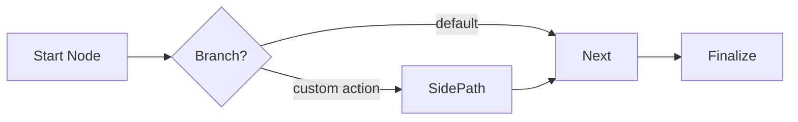

# Agentic Coding: Humans Design, Agents Code! (PocketMesh 0.3.0 + A2A)

> **This is the canonical prompt & playbook for AI agents or developers building PocketMesh 0.3.0 projects.**  
> Follow these guidelines to create robust, interoperable, multi-agent systems with first-class support for the official [`@a2a-js/sdk`](https://www.npmjs.com/package/@a2a-js/sdk).

---

## Quick Checklist (Read First!)

- **Imports:**  
  ```ts
  import { Flow, BaseNode, SharedState, Params } from "pocketmesh";
  import {
    A2ABaseNode,
    createPocketMeshA2AServer,
    a2aServerHandler,
    createA2AClient,
    generateAgentCard,
    isTextPart,
    isDataPart,
    isFilePart,
  } from "pocketmesh/a2a";
  ```
- **Strict Typing:** Define explicit interfaces for `SharedState` and `Params`. Avoid `any`.
- **Node Lifecycle:** Implement `prepare`, `execute`, and `finalize`. Provide `executeItem` + dummy `execute` for batch nodes.
- **Retries & Fallbacks:** Use `node.setOptions({ maxRetries, waitSeconds, parallel })` and implement `executeFallback`/`executeItemFallback` when needed.
- **A2A Helpers:** When building A2A-facing nodes, extend `A2ABaseNode` and use helpers:
  - `getIncomingMessage`, `getIncomingParts`, `getIncomingData`
  - `setFinalResponseParts`, `setFinalResponseData`
  - `emitArtifact`, `createTextPart`, `createDataPart`, `createFilePart`
- **Protocol:** The SDK exposes `message/send`, `message/stream`, `tasks/get`, `tasks/cancel`, push-notification endpoints, etc.
- **Persistence:** By default PocketMesh stores state in SQLite (`pocketmesh.sqlite`). It maps A2A task IDs to flow runs via `PocketMeshTaskStore`. You can inject your own `Persistence` implementation.
- **Testing:** Use Jest (`npm test -- --coverage`). Test flows, retry logic, and A2A wiring.

---

## 1. Requirements

- Gather clear requirements: skill descriptions, inputs/outputs, latency expectations, streaming needs.
- Identify external dependencies (LLMs, APIs, tools) and credentials.
- Decide whether the flow will be exposed over A2A, run locally, or both.

---

## 2. Designing Flows

### Flow anatomy



1. **Start node:** prepares initial data from params or incoming A2A message.
2. **Branching nodes:** choose the next node by returning action strings.
3. **Batch nodes:** use `executeItem` + `setOptions({ parallel: true })` for fan-out work.
4. **Final node:** writes output to shared state (and to A2A message if exposed).

### Shared state & params

```ts
interface GreetingState {
  greeting?: string;
  result?: string;
  // A2A context (auto-populated by the server):
  __a2a_incoming_message?: Message;
  __a2a_history?: Message[];
  __a2a_final_response_parts?: Part[];
  __a2a_artifacts?: Artifact[];
  __a2a_task_id?: string;
}

interface GreetingParams {
  name?: string;
  shout?: boolean;
}
```

---

## 3. Implementing Nodes

### Base node template

```ts
class MyNode extends BaseNode<GreetingState, GreetingParams, Prep, ExecResult, string> {
  async prepare(shared, params) { /* … */ }
  async execute(prep, shared, params, attempt) { /* … */ }
  async finalize(shared, prep, execResult, params) { return "default"; }
}
```

### Batch node pattern

```ts
class BatchNode extends BaseNode<GreetingState, GreetingParams, string[], string[], string> {
  async prepare(shared) { return [shared.greeting ?? "Hi"]; }

  async execute(_prep, _shared, _params, _attempt) {
    throw new Error("Not used in batch node");
  }

  async executeItem(item, shared, params, attempt) {
    return item.toUpperCase();
  }

  async finalize(shared, _prep, execResult) {
    shared.result = execResult.join(" ");
    return "default";
  }
}

const node = new BatchNode();
node.setOptions({ maxRetries: 2, parallel: true });
```

### A2A-aware node (`A2ABaseNode`)

```ts
class HandleA2AInputNode extends A2ABaseNode<GreetingState, GreetingParams> {
  async prepare(shared) {
    const message = this.getIncomingMessage(shared);
    const text = this.getIncomingParts(shared).find(isTextPart)?.text ?? "Hello!";
    shared.greeting = text;
    return message;
  }

  async execute(_prep, shared, _params, _attempt) {
    return { processed: new Date().toISOString() };
  }

  async finalize(shared, _prep, execResult) {
    this.setFinalResponseData(shared, { status: "ok", ...execResult });
    return "default";
  }
}
```

---

## 4. Assembling the Flow

```ts
const greet = new HandleA2AInputNode();
const branch = new BranchNode();
const echo = new EchoNode();
const shout = new BatchNode();

greet.connectTo(branch);
branch.connectAction("echo", echo);
branch.connectAction("shout", shout);

export const greetingFlow = new Flow(greet);
```

Add logging or observers:

```ts
greetingFlow.onStatusUpdate = (status) => {
  console.log(`[${status.node}] ${status.state}: ${status.message ?? ""}`);
};

greetingFlow.onArtifact = (artifact) => {
  console.log("Artifact emitted:", artifact.name);
};
```

---

## 5. Exposing Flows as A2A Agents

### Agent card

```ts
const agentCard = generateAgentCard({
  name: "Greeting Agent",
  url: "https://greeter.example.com",
  version: "1.0.0",
  protocolVersion: "0.3.0",
  skills: [
    {
      id: "greet",
      name: "Greet",
      description: "Greets a user and optionally shouts the message.",
      inputModes: ["text"],
      outputModes: ["text", "json"],
      tags: ["demo"],
      examples: ["Say hi to Carol politely."],
    },
  ],
  defaultInputModes: ["text"],
  defaultOutputModes: ["text"],
  capabilities: {
    streaming: true,
    pushNotifications: false,
    stateTransitionHistory: true,
  },
});
```

Serve it at `/.well-known/agent-card.json`.

### Express setup

```ts
const app = express();
app.use(express.json());

app.get("/.well-known/agent-card.json", (_req, res) => res.json(agentCard));

a2aServerHandler({
  flows: { greet: greetingFlow },
  agentCard,
})(app, "/a2a"); // registers JSON-RPC + streaming routes

app.listen(4000, () => console.log("Agent live on http://localhost:4000"));
```

Internally this wires `PocketMeshExecutor`, `PocketMeshTaskStore`, and the SDK `DefaultRequestHandler`.

### Customising persistence or executors

```ts
const server = createPocketMeshA2AServer({
  flows: { greet: greetingFlow },
  agentCard,
  persistence: myCustomPersistence, // optional
});

server.expressApp.setupRoutes(app, "/a2a");
```

Provide your own `TaskStore`/`AgentExecutor` if needed.

---

## 6. Calling Other Agents (A2A Client Nodes)

```ts
import { randomUUID } from "crypto";

class CallRemoteAgentNode extends BaseNode<SharedState, { remoteUrl: string; skillId: string }> {
  async execute(_prep, _shared, params, _attempt) {
    const client = await createA2AClient(params.remoteUrl);
    const response = await client.sendMessage({
      message: {
        kind: "message",
        messageId: randomUUID(),
        taskId: randomUUID(),
        contextId: randomUUID(),
        role: "user",
        metadata: { skillId: params.skillId },
        parts: [{ kind: "text", text: "Ping!" }],
      },
      configuration: { blocking: true },
    });

    const text = response.result?.parts?.find((part) => part.kind === "text")?.text;
    return { text };
  }

  async finalize(shared, _prep, execResult) {
    shared.remoteReply = execResult.text;
    return "default";
  }
}
```

Streaming responses:

```ts
for await (const event of client.sendMessageStream({ /* ... */ })) {
  if (event.kind === "artifact-update") console.log(event.artifact);
}
```

---

## 7. Persistence & Multi-turn Conversations

- The default SQLite persistence links each A2A `taskId` to a flow `runId`.
- Shared state snapshots (including `__a2a_history`) are saved after every node.
- For multi-turn interactions:
  - Return `"input-required"` from `finalize` when waiting for user input.
  - The next `message/send` with the same `taskId` resumes the flow where it paused.
- Custom persistence: implement the `Persistence` interface and inject it into `a2aServerHandler` or `createPocketMeshA2AServer`.

---

## 8. Integrating LLMs & External APIs

Use nodes as adapters for LLM calls:

```ts
class AskLLMNode extends BaseNode<any, { question: string }, string, string, string> {
  async prepare(_shared, params) {
    return params.question;
  }

  async execute(question, _shared, _params, _attempt) {
    const completion = await openai.responses.create({
      model: "gpt-4.1-mini",
      input: question,
    });
    return completion.output_text;
  }

  async finalize(shared, _prep, execResult) {
    shared.answer = execResult;
    return "default";
  }
}
```

Wrap calls in retries/fallbacks and sanitise outputs before storing them in shared state.

For streaming tokens, emit artifacts from `execute` (see the developer docs).

---

## 9. Testing Strategy

- **Unit tests:** instantiate flows and nodes, assert on shared state.
- **Integration tests:** mock dependencies (LLMs, persistence), assert on artefacts and status updates.
- **A2A tests:** use `supertest` to send JSON-RPC payloads to the Express app.
- **Coverage:** `npm test -- --coverage` generates text + HTML reports.

```
npm test
npm test -- --watch
npm test -- --coverage
```

Focus on:

- Error handling paths (prepare/execute/finalize throwing).
- Batch retry logic.
- A2A message/stream integration.

---

## 10. Deliverables & Code Quality

- Provide flows (`Flow` instances), nodes (`BaseNode`/`A2ABaseNode` subclasses), and entrypoints (Express or CLI).
- Include A2A agent cards and server wiring if exposing flows.
- Update README or docs to reflect new skills.
- Provide Jest tests covering happy paths and edge cases.
- Ensure TypeScript passes (`npm run build`).

---

## Reference Project Structure

```filetree
my-agent/
├── src/
│   ├── flows/
│   │   └── greeting-flow.ts
│   ├── nodes/
│   │   ├── greet-node.ts
│   │   ├── branch-node.ts
│   │   └── shout-node.ts
│   ├── server/
│   │   ├── agent-card.ts
│   │   └── express.ts
│   └── index.ts
├── __tests__/
│   ├── greeting-flow.test.ts
│   └── a2a-server.test.ts
├── docs/
│   └── developer/ (optional extended docs)
├── package.json
└── pocketmesh.sqlite
```

---

## Final Reminder for AI Agents

- Use the imports shown at the top of this doc—no deep `"dist"` paths.
- Respect the A2A schema when reading/writing messages and artifacts.
- Persist and resume state correctly; set `__a2a_final_response_parts` for responses.
- Write tests, demonstrate coverage, and document your flows.

**Happy building with PocketMesh 0.3.0!**  
Bring deterministic control, streaming artifacts, and multi-agent collaboration together in TypeScript.
