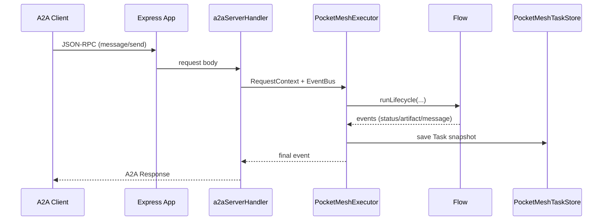

# Building A2A Agents with PocketMesh

PocketMesh 0.3.0 ships with native support for the official [`@a2a-js/sdk`](https://www.npmjs.com/package/@a2a-js/sdk). This guide walks you through exposing PocketMesh flows as interoperable Agent-to-Agent services.



## Why use the SDK?

- **Spec alignment** – immediate support for the latest A2A features (streaming, cancellation, push notifications).
- **Interoperability** – other agents can discover and interact with your flows out-of-the-box.
- **Less boilerplate** – the SDK handles JSON-RPC dispatch, SSE streaming, and push notifications.

## Prerequisites

- PocketMesh flow configured (see [quickstart-flow.md](./quickstart-flow.md)).
- Express application (or any HTTP framework that can host an Express app).
- Node.js ≥ 18 (for fetch, AbortController, async generators).

## Step 1: Create an AgentCard

```ts
import { generateAgentCard } from "pocketmesh/a2a";

const agentCard = generateAgentCard({
  name: "Greeting Agent",
  url: "https://greeter.example.com",
  version: "1.0.0",
  protocolVersion: "0.3.0",
  skills: [
    {
      id: "greet",
      name: "Greet",
      description: "Greets a user and optionally shouts the message.",
      inputModes: ["text"],
      outputModes: ["text"],
      tags: ["demo"],
      examples: ["greet Alice politely"],
    },
  ],
  capabilities: {
    streaming: true,
    pushNotifications: false,
    stateTransitionHistory: true,
  },
  defaultInputModes: ["text"],
  defaultOutputModes: ["text"],
});
```

Expose the card at `/.well-known/agent-card.json` so other agents can discover your API.

## Step 2: Wire flows to the SDK

```ts
import express from "express";
import { greetingFlow } from "../flows/greeting-flow";
import { a2aServerHandler } from "pocketmesh/a2a";
import { agentCard } from "./agent-card";

const app = express();
app.use(express.json());

// Serve the agent card
app.get("/.well-known/agent-card.json", (_req, res) => res.json(agentCard));

// Register all A2A endpoints under /a2a
a2aServerHandler({
  flows: { greet: greetingFlow },
  agentCard,
})(app, "/a2a");

app.listen(4000, () =>
  console.log("A2A agent listening at http://localhost:4000"),
);
```

`a2aServerHandler` builds a `DefaultRequestHandler` under the hood, wiring PocketMesh’s executor and task store to the SDK’s JSON-RPC routes.

## Step 3: Clients that call your agent

```ts
import { randomUUID } from "crypto";
import { createA2AClient } from "pocketmesh/a2a";

const client = await createA2AClient("https://greeter.example.com");

const response = await client.sendMessage({
  message: {
    kind: "message",
    messageId: randomUUID(),
    taskId: randomUUID(),
    contextId: randomUUID(),
    role: "user",
    metadata: { skillId: "greet" },
    parts: [{ kind: "text", text: "Say hello to PocketMesh" }],
  },
  configuration: { blocking: true },
});

console.log(response.result?.parts?.[0]?.text);
```

For streaming:

```ts
for await (const event of client.sendMessageStream({
  message: { /* same structure as above */ },
  configuration: { blocking: false },
})) {
  console.log("STREAM EVENT", event);
}
```

## Optional: Customising persistence & executors

PocketMesh provides defaults:

- `PocketMeshTaskStore` saves tasks to SQLite (`src/utils/persistence.ts`).
- `PocketMeshExecutor` runs flows and publishes events.

If you need to override them (e.g., to integrate with another database), use `createPocketMeshA2AServer`:

```ts
import {
  createPocketMeshA2AServer,
  PocketMeshTaskStore,
  PocketMeshExecutor,
} from "pocketmesh/a2a";

const server = createPocketMeshA2AServer({
  flows: { greet: greetingFlow },
  agentCard,
  persistence: myCustomPersistence,
  taskStore: new PocketMeshTaskStore(myCustomPersistence),
  executorFactory: (flows, persistence, taskStore) =>
    new PocketMeshExecutor(flows, persistence, taskStore),
});

server.expressApp.setupRoutes(app, "/a2a");
```

Extend or replace components as needed, provided your implementations fulfil the SDK interfaces.

## Handling cancellations & push notifications

```ts
// Cancel a task
await client.cancelTask({ id: taskId });

// Configure push notifications (if capabilities.pushNotifications = true)
await client.setTaskPushNotificationConfig({
  taskId,
  url: "https://webhook.example.com/a2a-events",
  token: "secret",
});
```

Ensure your flows expose a way to stop long-running work when the executor’s `cancelTask` method is invoked (e.g., by setting a flag in shared state).

## Best practices

- **Skill IDs** map directly to flow names. Keep them descriptive.
- **Metadata** is preserved throughout the task lifecycle—use it for contextual data or routing.
- **Artifacts** should comply with the A2A schema (`kind: "text" | "file" | "data"`). Use `A2ABaseNode.emitArtifact`.
- Keep `PocketMeshTaskStore` in sync with your persistence to support `getTask`, streaming resubscriptions, and push notifications.

## Troubleshooting

| Symptom | Possible cause | Fix |
| --- | --- | --- |
| Client receives `Method not found` | Skill ID missing or mismatch | Ensure the `metadata.skillId` matches `flows` key |
| Streaming stops unexpectedly | Flow didn’t emit final status | Ensure `PocketMeshExecutor` publishes final `status-update` events (default behaviour) |
| Task not persisted | Persistence interface incomplete | Implement `saveTaskSnapshot` / `getTaskSnapshot` or reuse the provided SQLite store |

You’re now ready to expose rich agent workflows to the broader A2A ecosystem. Continue with [llm-integration.md](./llm-integration.md) if you plan to augment your agent with model calls.
