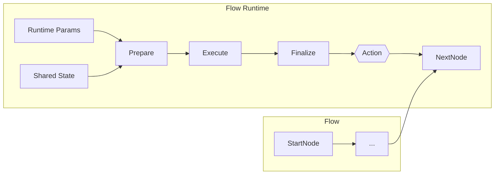

# PocketMesh Architecture Primer

Understanding the moving parts of PocketMesh will help you reason about flows, customise behaviour, and debug with confidence. This guide breaks down the core abstractions and how they interact.

> **TL;DR**  
> PocketMesh is a typed orchestration layer composed of **Nodes** connected in **Flows**, backed by a pluggable **Persistence** store, enriched with optional **A2A** and **LLM** integrations.



## Core building blocks

### 1. Nodes (`BaseNode`)

Nodes encapsulate a unit of work. Each node implements three lifecycle methods:

- `prepare(shared, params)` – gather prerequisites or derive inputs.
- `execute(prepResult, shared, params, attempt)` – perform the main action (may run multiple times if retries are enabled).
- `finalize(shared, prepResult, execResult, params)` – update shared state and choose the next action/branch.

Optional hooks:

- `executeItem(item, shared, params, attempt)` for batch nodes.
- `executeFallback` / `executeItemFallback` for retry scenarios.

### 2. Flows (`Flow`)

Flows connect nodes and orchestrate execution. They manage:

- Branching via `connectAction("branchName", node)`.
- Batching and retry logic (delegated to nodes but orchestrated centrally).
- Event hooks for progress (`onStatusUpdate`) and artifacts (`onArtifact`).
- Shared state propagation across nodes.

### 3. Persistence

The default SQLite implementation keeps a durable record of `runs`, `steps`, and A2A task mappings. You can inject your own persistence provider anywhere the `Persistence` interface is required.

### 4. A2A Integration

PocketMesh 0.3.0 bridges flows with the official `@a2a-js/sdk`. The key components are:

- `PocketMeshTaskStore` (TaskStore implementation backed by PocketMesh persistence).
- `PocketMeshExecutor` (adapts Flow events to the SDK `ExecutionEventBus`).
- `a2aServerHandler`/`createPocketMeshA2AServer` (register Express routes with `DefaultRequestHandler`).
- `createA2AClient` (async wrapper returning the SDK client).

### 5. LLM Integration (Optional)

PocketMesh doesn’t dictate which models or providers you use. Instead, it offers:

- A safe place (nodes) to call your preferred LLM client.
- Built-in retry/fallback to wrap model calls.
- Hooks for streaming tokens or artifacts over A2A.

## How execution flows through the system

```mermaid
sequenceDiagram
  participant Caller as Caller
  participant Flow as Flow.runLifecycle
  participant Node as Active Node
  participant Persist as Persistence

  Caller->>Flow: runLifecycle(shared, params)
  Flow->>Node: prepare(shared, params)
  Node-->>Flow: prepResult
  Flow->>Persist: addStep(runId, "PREP", ...)
  loop Retries
    Flow->>Node: execute(prepResult, shared, params, attempt)
    alt success
      Node-->>Flow: execResult
      break
    else failure
      Node-->>Flow: throws Error
      Flow->>Node: executeFallback(...)
    end
  end
  Flow->>Node: finalize(shared, prepResult, execResult)
  Node-->>Flow: action
  Flow->>Persist: addStep(runId, "FINALIZE", shared)
  Flow->>Flow: getNextNode(action)
  Flow-->>Caller: final action ("default")
```

## Key concepts and terminology

| Term | Meaning |
| --- | --- |
| **Shared state** | Mutable object passed through every node; your long-lived state bag. |
| **Params** | Runtime inputs when starting or resuming a flow. |
| **Run** | Persistent record of a flow execution. |
| **Step** | Snapshot of shared state per node execution. |
| **Artifact** | A2A-compliant payload emitted mid-flow (e.g., files, structured data). |
| **Action** | String returned by `finalize` to determine the next node. |

## Where to go next

- Build something concrete in [quickstart-flow.md](./quickstart-flow.md).
- Explore [a2a-agents.md](./a2a-agents.md) to publish your flow.
- Dive into state management in [persistence-and-state.md](./persistence-and-state.md).

Keep experimenting! PocketMesh embraces small composable pieces, so mastering nodes and flows will unlock everything else.
