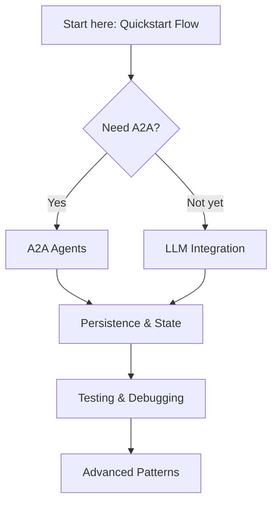

# PocketMesh Developer Hub

Welcome to the PocketMesh developer documentation! This mini-site walks you through every step of building, testing, and deploying PocketMesh flows and agents. Whether you're stitching together local automations, orchestrating LLM-powered pipelines, or publishing a network of interoperable A2A agents, the guides in this folder have you covered.

## Who is this for?

- **Newcomers** who want a fast, friendly on-ramp to the PocketMesh mindset.
- **Agent builders** who need a playbook for exposing flows via the A2A protocol.
- **LLM practitioners** who want to combine deterministic flow control with model calls.
- **Teams** that plan to extend PocketMesh with custom persistence, logging, or integrations.

## What you'll find

| Guide | What you’ll learn |
| --- | --- |
| [architecture.md](./architecture.md) | The core concepts behind nodes, flows, persistence, and event hooks. |
| [quickstart-flow.md](./quickstart-flow.md) | Build your first flow from scratch—branching, batching, and retries included. |
| [a2a-agents.md](./a2a-agents.md) | Publish PocketMesh flows as interoperable A2A agents using the official SDK. |
| [llm-integration.md](./llm-integration.md) | Safely blend LLM calls into flows with retries, batching, and streaming outputs. |
| [persistence-and-state.md](./persistence-and-state.md) | Master state management: shared state lifecycles, FlowStepper, and custom persistence. |
| [testing-and-debugging.md](./testing-and-debugging.md) | Experience-led advice for Jest-driven workflows, coverage, and observability. |
| [advanced-patterns.md](./advanced-patterns.md) | Recipes for multi-agent meshes, orchestrating external services, and scaling. |

Each guide embraces a “learn-by-building” approach: expect runnable TypeScript snippets, visual diagrams, and checklists. We’ve structured the documentation so you can skim for quick wins or dive deep when architecting your next agentic system.

## Not sure where to start?

1. **Quickstart Flow** gives you the intuition you need to compose nodes.
2. Choose **A2A Agents** or **LLM Integration** depending on your immediate goal.
3. Deepen your knowledge with state management, testing, and advanced patterns.

Ready? Head over to [quickstart-flow.md](./quickstart-flow.md) and start building!
