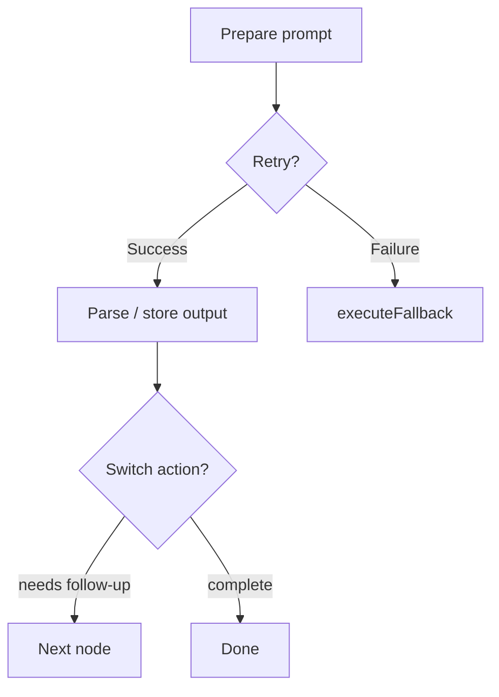
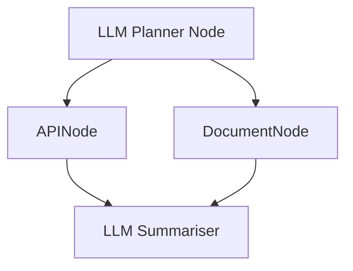

# Integrating LLMs into PocketMesh Flows

PocketMesh excels at orchestrating deterministic logic around model calls. This guide covers patterns for calling LLMs (OpenAI, Vertex, local models, etc.) within flows, handling retries, batching prompts, and streaming results.

## Choosing where to call an LLM

- **`execute`** – for single prompt/response interactions.
- **`executeItem`** – when batch-processing prompts.
- **`finalize`** – to collate model outputs and determine next steps.



## Example: Invoking OpenAI in a node

```ts
import OpenAI from "openai";
import { BaseNode } from "pocketmesh";

const openai = new OpenAI({ apiKey: process.env.OPENAI_API_KEY });

interface LLMState {
  answer?: string;
  error?: string;
}

interface LLMParams {
  question: string;
}

class AskOpenAINode extends BaseNode<LLMState, LLMParams, string, string, string> {
  async prepare(_shared, params) {
    return params.question;
  }

  async execute(question) {
    const completion = await openai.responses.create({
      model: "gpt-4.1-mini",
      input: question,
    });
    return completion.output_text;
  }

  async executeFallback(_prep, error, shared) {
    shared.error = (error as Error).message;
    return "I’m sorry, I couldn’t generate an answer.";
  }

  async finalize(shared, _prep, execResult) {
    shared.answer = execResult;
    return "default";
  }
}
```

### Tips

- Configure `maxRetries` on the node: `askNode.setOptions({ maxRetries: 2, waitSeconds: 1 })`.
- Capture structured information from LLM outputs before storing it in shared state.
- Combine with guardrail libraries or validators in `finalize`.

## Streaming responses to A2A clients

```ts
class StreamTokensNode extends BaseNode<any, any, string, string, string> {
  async prepare(_shared, params) {
    return params.prompt;
  }

  async execute(prompt, shared, _params, attempt) {
    const stream = await openai.responses.stream({
      model: "gpt-4.1",
      input: prompt,
    });

    for await (const event of stream) {
      if (event.type === "response.output_text.delta") {
        shared.partial = (shared.partial ?? "") + event.delta;
        this.flow?.onArtifact?.({
          artifactId: `delta-${attempt}`,
          parts: [{ kind: "text", text: event.delta }],
          append: true,
        });
      }
    }

    return shared.partial ?? "";
  }

  async finalize(shared, _prep, execResult) {
    shared.answer = execResult;
    return "default";
  }
}
```

With A2A streaming (see [a2a-agents.md](./a2a-agents.md)), downstream clients receive chunked updates in near real-time.

## Batching prompts

```ts
class BatchLLMNode extends BaseNode<any, { prompts: string[] }, string[], string[], string> {
  async prepare(_shared, params) {
    return params.prompts;
  }

  async execute() {
    throw new Error("execute is unused for batch nodes");
  }

  async executeItem(prompt) {
    const completion = await openai.responses.create({ model: "gpt-4o-mini", input: prompt });
    return completion.output_text;
  }

  async finalize(shared, _prep, outputs) {
    shared.answers = outputs;
    return "default";
  }
}
```

Use `parallel: true` in `setOptions` when you want to fan out requests (mind rate limits). Combine with retries to gracefully recover from transient failures.

## Tool calling & multi-step reasoning

PocketMesh is agnostic to tool-calling frameworks. One effective pattern:

1. **LLM node** creates a plan (list of structured steps).
2. **Flow** branches to specialised nodes for each tool.
3. Shared state collects intermediate artifacts (JSON, files, etc.).
4. Final node summarises outcomes using another model call.



Keep each LLM call focused, deterministic where possible, and surround them with strong validation logic (Zod, TypeScript type guards, etc.).

## Security & cost controls

- Store API keys securely (`process.env`, secret manager, etc.).
- Implement rate-limiting or request queues for high-volume flows.
- Monitor usage by logging each prompt/response pair with correlation IDs (the shared state is a good place to store them).

## Debugging tips

- Capture model prompts/outputs in shared state for later inspection (scrub sensitive data first).
- Use the Jest-based testing strategy from [testing-and-debugging.md](./testing-and-debugging.md) to stub LLM responses during unit tests.
- When streaming, log each artifact or status update to verify the order and content of events.

You’re now equipped to combine PocketMesh’s deterministic control flow with the flexibility of LLMs. Continue with [persistence-and-state.md](./persistence-and-state.md) to keep long-running conversations and multi-step reasoning intact.
