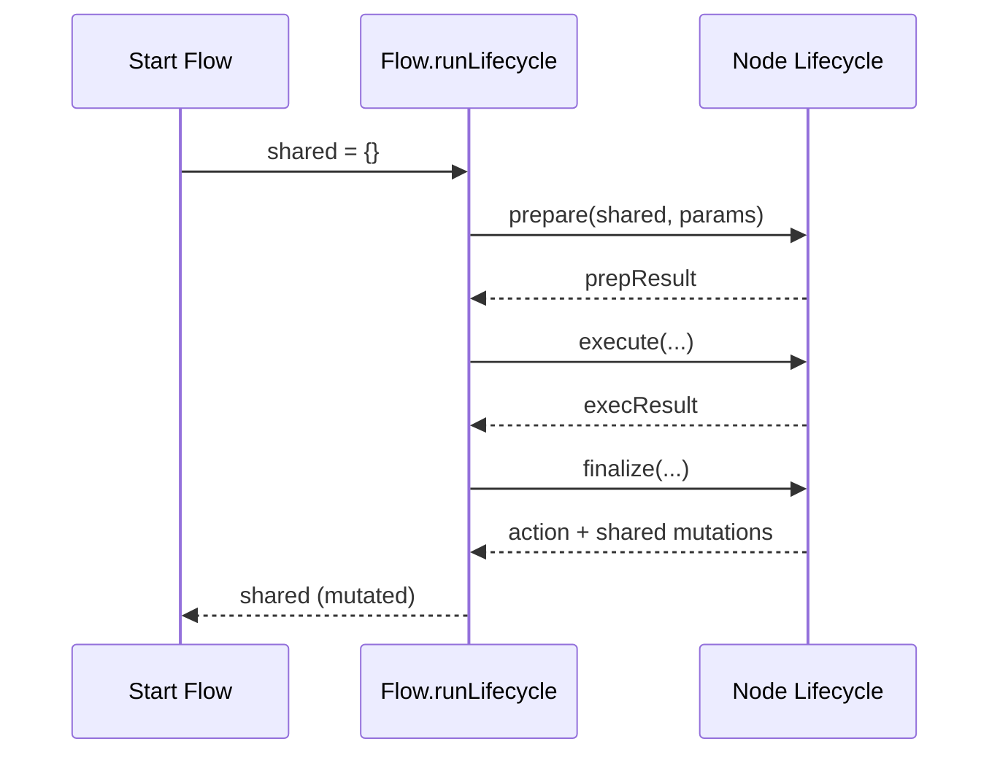
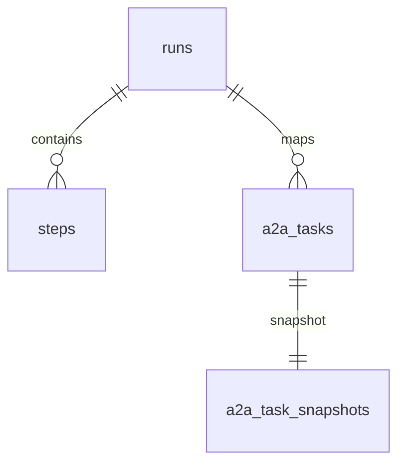

# Persistence & State Management

PocketMesh flows are stateful by design. This guide explains how shared state travels through nodes, how persistence captures execution history, and how to customise or replace the default SQLite implementation.

## Shared state lifecycle



- Shared state is a mutable object (`Record<string, unknown>` by default).
- Each node reads/writes the **same** object—no copies unless you create them.
- Persisted steps serialise `shared` after each node to allow replays/resumptions.

### Best practices

- Define explicit interfaces for shared state (`interface MyState { ... }`).
- Reset or delete transient fields in `finalize` if they don’t belong in the persisted snapshot.
- Store identifiers (task IDs, external references) in shared state to coordinate cross-node work.

## Persistence layer overview

The default SQLite implementation (in `src/utils/persistence.ts`) manages three tables:

| Table | Purpose |
| --- | --- |
| `runs` | Flow executions (`id`, `flow_name`, `status`, timestamps). |
| `steps` | Snapshots of shared state per node (includes step index, node name, JSON serialised state). |
| `a2a_tasks` | Mapping between A2A task IDs and run IDs. |
| `a2a_task_snapshots` | Cached SDK Task objects (for `getTask`, resubscribe, cancellation). |



### Key persistence API

```ts
interface Persistence {
  createRun(flowName: string): number;
  getRun(runId: number): RunRecord | undefined;
  updateRunStatus(runId: number, status: string): void;
  addStep(runId: number, nodeName: string, action: string | null, stepIndex: number, sharedState: object): number;
  getStepsForRun(runId: number): StepRecord[];
  getLastStep(runId: number): StepRecord | undefined;
  mapA2ATaskToRun(taskId: string, runId: number): void;
  getRunIdForA2ATask(taskId: string): number | undefined;
  saveTaskSnapshot(taskId: string, snapshot: Record<string, unknown>): void;
  getTaskSnapshot(taskId: string): Record<string, unknown> | undefined;
  deleteRun(runId: number): void;
  deleteA2ATask(taskId: string): void;
}
```

## FlowStepper: step-by-step execution

`FlowStepper` lets you resume or single-step flows manually—useful for debugging or long-running workflows.

```ts
import { FlowStepper } from "pocketmesh/stepper";
import { greetingFlow } from "./flow";
import { sqlitePersistence } from "pocketmesh/dist/utils/persistence";

const stepper = new FlowStepper(
  { flowName: "greeting", flowFactory: () => greetingFlow, persistence: sqlitePersistence },
  {}, // initial shared state
  { name: "Mesh" }, // params
);

await stepper.step(); // Run first node
console.log(stepper.getSharedState());
```

FlowStepper reads/writes the same persistence tables, so you can seamlessly switch between automated execution (`runLifecycle`) and manual stepping.

## Custom persistence

When to customise:

- You need a different database (PostgreSQL, DynamoDB, etc.).
- You want to enrich step metadata (e.g., user IDs).
- Compliance requirements demand bespoke retention policies.

Implementation tips:

1. Implement the `Persistence` interface.  
2. Reuse the existing schema as a reference.  
3. Inject your persistence wherever PocketMesh expects one:
   - `new FlowStepper({ persistence: myPersistence })`
   - `a2aServerHandler({ persistence: myPersistence, ... })`
   - `createPocketMeshA2AServer({ persistence: myPersistence, ... })`

### Example skeleton

```ts
const myPersistence: Persistence = {
  createRun: (flowName) => { /* ... */ },
  getRun: (runId) => { /* ... */ },
  updateRunStatus: (runId, status) => { /* ... */ },
  addStep: (runId, nodeName, action, stepIndex, shared) => { /* ... */ },
  getStepsForRun: (runId) => { /* ... */ },
  getLastStep: (runId) => { /* ... */ },
  mapA2ATaskToRun: (taskId, runId) => { /* ... */ },
  getRunIdForA2ATask: (taskId) => { /* ... */ },
  saveTaskSnapshot: (taskId, snapshot) => { /* ... */ },
  getTaskSnapshot: (taskId) => { /* ... */ },
  deleteRun: (runId) => { /* ... */ },
  deleteA2ATask: (taskId) => { /* ... */ },
};
```

## Resuming runs via A2A

When you expose flows via A2A, the SDK-driven task store automatically:

- Links new tasks to `runs`.
- Stores history and artifacts in `shared.__a2a_history` / `__a2a_artifacts`.
- Persists final state when tasks complete, fail, or are cancelled.

Clients can call `getTask` or `resubscribeTask` to retrieve the most recent snapshot.

## Debugging persistence issues

- **Mismatch between tasks and runs**: ensure `mapA2ATaskToRun` is called whenever you create task snapshots.
- **Stale data**: call `deleteA2ATask` when cleaning up runs to cascade snapshots.
- **JSON serialization errors**: ensure everything written to shared state is serialisable. Convert classes or complex objects to plain JSON before persisting.

## Summary

- Shared state is mutable, serialisable, and travels with every node.
- Persistence keeps execution history and supports resumption.
- FlowStepper and A2A integrations rely on the same persistence API—swap in custom implementations as needed.

Next, learn how to verify behaviours and keep your flows healthy in [testing-and-debugging.md](./testing-and-debugging.md).
