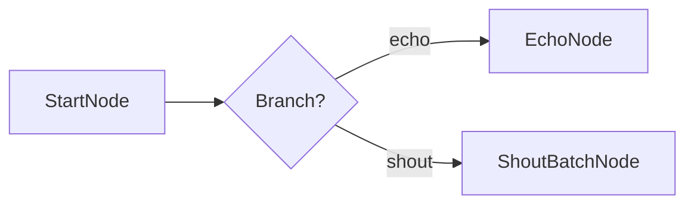

# Quickstart: Your First PocketMesh Flow

Ready to build? This tutorial walks you through creating a flow that greets users, branches on a runtime flag, and persists output. By the end you’ll understand the core APIs and have a template you can adapt.

> **Prerequisites**  
> - Node.js 18+  
> - `npm install pocketmesh` (the library ships as ESM + CJS)  
> - TypeScript project (recommended but not required)



## 1. Define your shared state and params

```ts
// shared-state.ts
export interface GreetingState {
  greeting?: string;
  result?: string;
}

export interface GreetingParams {
  name?: string;
  shout?: boolean;
}
```

## 2. Create nodes

```ts
import {
  BaseNode,
  SharedState,
  Params,
  ActionResult,
} from "pocketmesh";
import type { GreetingState, GreetingParams } from "./shared-state";

// Node 1: Generate the greeting text
class GreetNode extends BaseNode<GreetingState, GreetingParams, string, string, string> {
  async prepare(shared, params) {
    const name = params.name ?? "World";
    shared.greeting = `Hello, ${name}!`;
    return shared.greeting;
  }

  async execute(greeting) {
    return greeting;
  }

  async finalize(_shared, _prep, execResult) {
    return execResult.includes("!") ? "branch" : "default";
  }
}

// Node 2: Decide between echo or shout
class BranchNode extends BaseNode<GreetingState, GreetingParams, string, string, string> {
  async prepare(shared) {
    return shared.greeting ?? "Hello, World!";
  }

  async execute(prepResult, params) {
    return params.shout ? "shout" : "echo";
  }

  async finalize(_shared, _prep, action) {
    return action;
  }
}

// Node 3a: Echo the message
class EchoNode extends BaseNode<GreetingState, GreetingParams, string, string, string> {
  async prepare(shared) {
    return shared.greeting ?? "Hello!";
  }
  async execute(message) {
    return message;
  }
  async finalize(shared, _prep, execResult) {
    shared.result = execResult;
    return "default";
  }
}

// Node 3b: Shout the message twice (batch example)
class ShoutBatchNode extends BaseNode<GreetingState, GreetingParams, string[], string[], string> {
  async prepare(shared) {
    return [shared.greeting ?? "HELLO!"];
  }
  async execute() {
    throw new Error("execute() is unused for batch nodes");
  }
  async executeItem(item) {
    return item.toUpperCase();
  }
  async finalize(shared, _prep, execResults) {
    shared.result = execResults.join(" ");
    return "default";
  }
}
```

## 3. Wire the flow together

```ts
import { Flow } from "pocketmesh";

const greet = new GreetNode();
const branch = new BranchNode();
const echo = new EchoNode();
const shout = new ShoutBatchNode();

greet.connectTo(branch);
branch.connectAction("echo", echo);
branch.connectAction("shout", shout);

export const greetingFlow = new Flow(greet);
```

## 4. Execute the flow

```ts
import type { GreetingState, GreetingParams } from "./shared-state";
import { greetingFlow } from "./flow";

const shared: GreetingState = {};
const params: GreetingParams = { name: "Mesh", shout: true };

await greetingFlow.runLifecycle(shared, params);

console.log(shared.result);
// => "HELLO, MESH!"
```

## 5. Enable logging and retries (optional tweaks)

```ts
// Increase retries for a flaky node
echo.setOptions({ maxRetries: 3, waitSeconds: 0.5 });

// Observe progress
greetingFlow.onStatusUpdate = (status) => {
  console.log(`[${status.node}] ${status.state}: ${status.message}`);
};
```

## 6. Persist and resume flows

PocketMesh ships with a SQLite-backed persistence layer. To resume flows manually, use `FlowStepper`, or rely on the A2A server integration (covered later). See [persistence-and-state.md](./persistence-and-state.md) for full coverage.

## What’s next?

- Serve your flow via A2A: [a2a-agents.md](./a2a-agents.md)
- Add LLM calls safely: [llm-integration.md](./llm-integration.md)
- Master shared state lifecycles: [persistence-and-state.md](./persistence-and-state.md)

From here you can adapt the patterns to any orchestration problem—PocketMesh composes well, so keep layering nodes to fit your domain.
